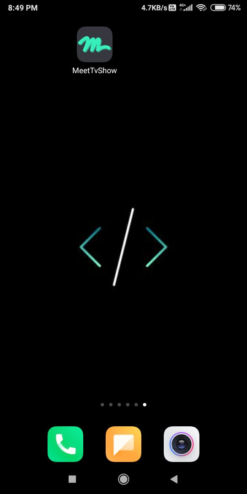
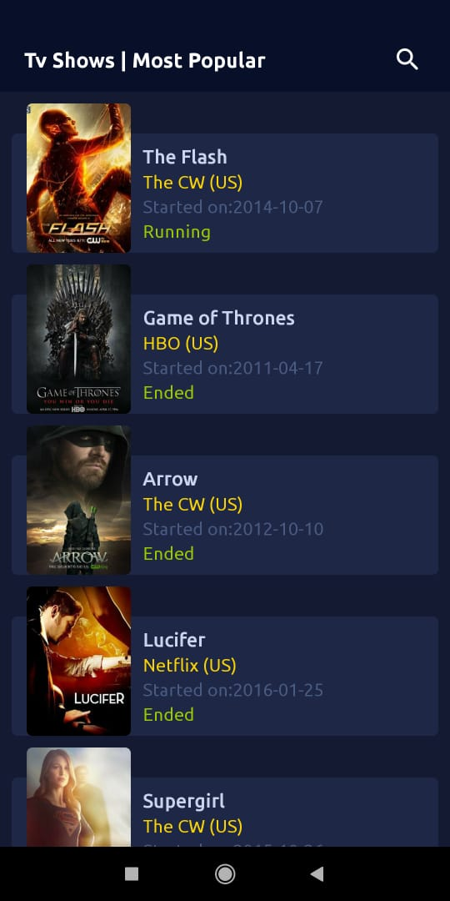
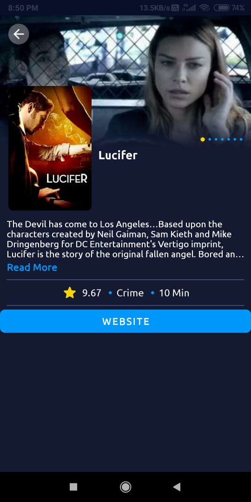
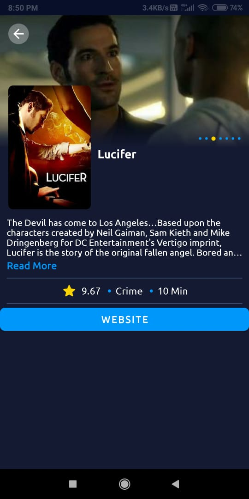
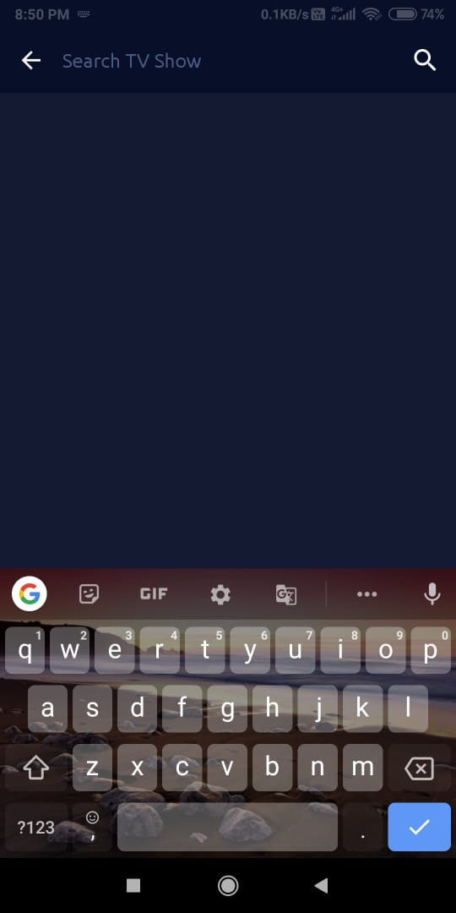
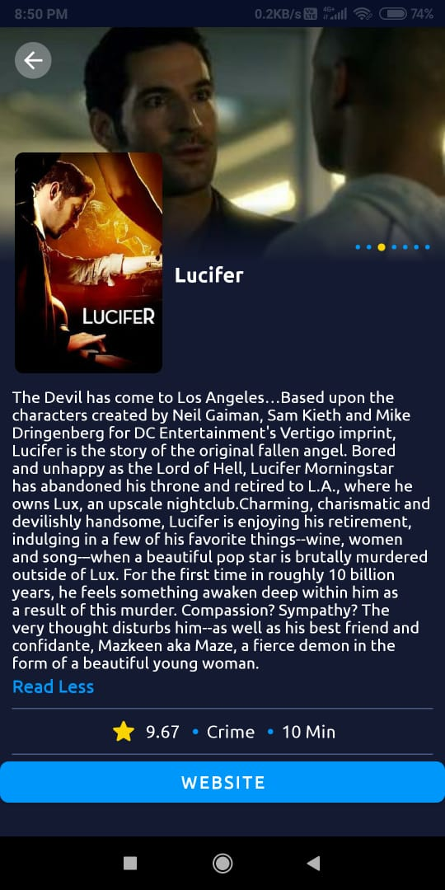

# MeetTvShow
MeetTvShow app with MVVM architecture.

Key Components:
1. MVVM Architecture
2. Retrofit
3. Material Design
4. Data Binding

# For api :
https://www.episodate.com/most-popular
# Screenshot

